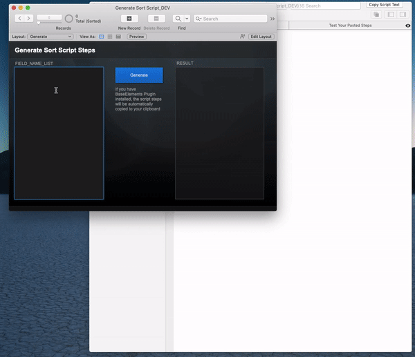

# fm-generate-sort-script

Generate FileMaker sort script steps based on fully-qualified field names.
Since FileMaker does not have `sort field by name`, this script will generate script logic to do that. Writing this manually is tedious, especially when you do it for multiple layouts and many fields. A script like this is ideal for clickable column header buttons that sort by the visible columns.

## Instructions

1. Install BaseElements plugin
2. Paste your fully-qualified field names in the input field
3. Click "Generate"
4. Paste the new script steps on your clipboard into a script.

